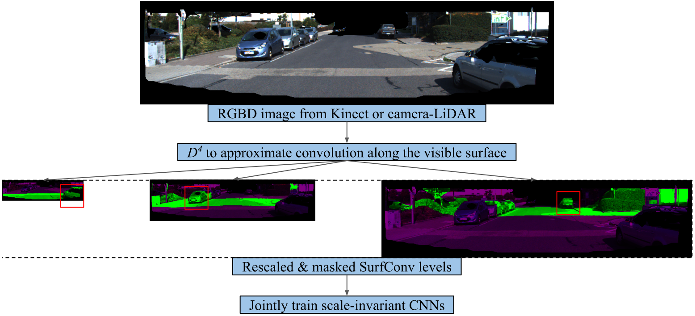

# SurfConv: A simple yet effective way to use RGBD data

## Paper:

**SurfConv: Bridging 3D and 2D Convolution for RGBD Images**  
Hang Chu, Wei-Chiu Ma, Kaustav Kundu, Raquel Urtasun, Sanja Fidler  
*CVPR 2018* \[[pdf](http://chuhang.github.io/files/publications/CVPR_18_1.pdf)\]

## How it works:


## Requirements:
- pytorch-0.2.0  
- pypng

## Usage:
### 1. Discretize depth using D4

```
cd ./D4
python resample_input.py
```

This will compute depth level boundaries of SurfConv, and generate resampled & masked images/labels for training.

### 2. Train on KITTI

```
cd ./train
python surfconv_kitti_scratch_train.py
```

This will train the model using images generated from step 1.
